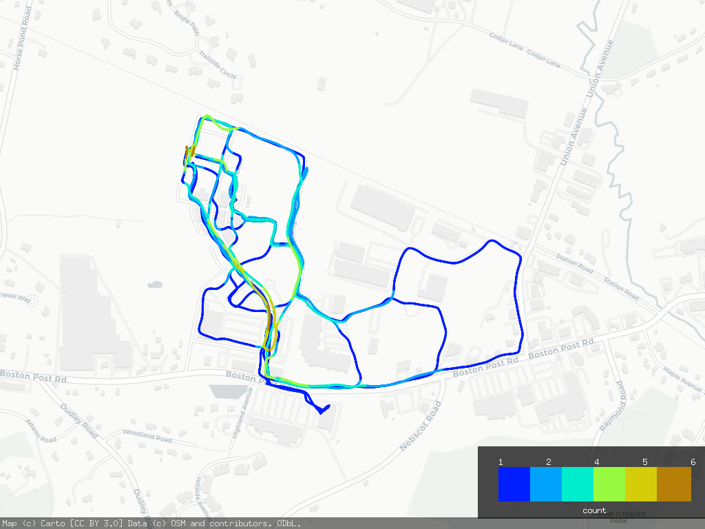

# GPXRainbow

GPXRainbow takes one or more .gpx files and plots their paths on an openstreetmap, adding color along the path to convey more information.

 
```
NAME:
   gpxrainbow - plots GPX tracks on an openstreetmap map with the color of the path conveying additional information

USAGE:
   main [global options] command [command options] [arguments...]

VERSION:
   1.0

COMMANDS:
   help, h  Shows a list of commands or help for one command

GLOBAL OPTIONS:
   --width value, -x value               width of output image (default: 2048)
   --height value, -y value              height of output image (default: 1536)
   --linewidth value, -l value           line width (in pixels) (default: 3)
   --mode value, -m value                mode - [proximity|speed|elevation|date] (default: "proximity")
   --tileprovider value, --tp value      OpenStreetMap tile provider, use --list-tileprovider to get a list (default: "carto-light")
   --list-tileprovider                   list available tileproviders for --tileprovider (default: false)
   --outputfile value, -o value          file to write the map to (must be a png) (default: "output.png")
   --proximity_distance value, -d value  distance in meters (approx) to color path the same in proximity mode (default: 10)
   --units value, -u value               units - "us" or "metric" (default: "metric")
   --help, -h                            show help (default: false)
   --version, -v                         print the version (default: false)
```

## Modes of operation

### Proximity

Proximity mode (`--mode proximity`) colors the point on path based on how many other paths are within `--proximity_distance` meters (default 10) of that point. This is useful when you feed in a whole season of bike rides and you want to visualize where you have been the most.  Cooler colors have fewer visits, warmer colors more.  

### Input-order

Input order mode (`--mode input`) colors each path with a different color along the rainbow starting with the cool end of the rainbow and ending at the warm end. 

### Speed

Speed mode (`--mode speed`) colors the path based on your speed.  There is a little bit of color smoothing going on to smooth out janky data from your GPX files, for a more pleasing visualization.  Use `--units us` to have the legend render the values in mph.

### Elevation

Elevation (`--mode elevation`) colors the graph based on your elevation.  This data comes from your GPX files and not the underlying map, and is moderately color-smoothed.  I've found my own data from my Apple Watch to not have the greatest fidelity. Use `--units us` to have the legend render the values in feet.

## Other notes

The core of this project is built on [go-staticmaps](https://github.com/flopp/go-staticmaps) which pulls in OpenStreetMap tiles.  The `--list-tileprovider` and `--tileprovider` options let you render different backing maps.  There is no support (yet) to remove the watermark if you've licensed one of the tile providers that requires an API key.  

The output file can be .png or .jpg

## Example

Making a map showing where I took the most morning walks one month:

```
> ./gpxrainbow -x 1024 -y 768 -m proximity --proximity_distance 20 -o example.png ../workout-routes/route_2019-05-*
```

